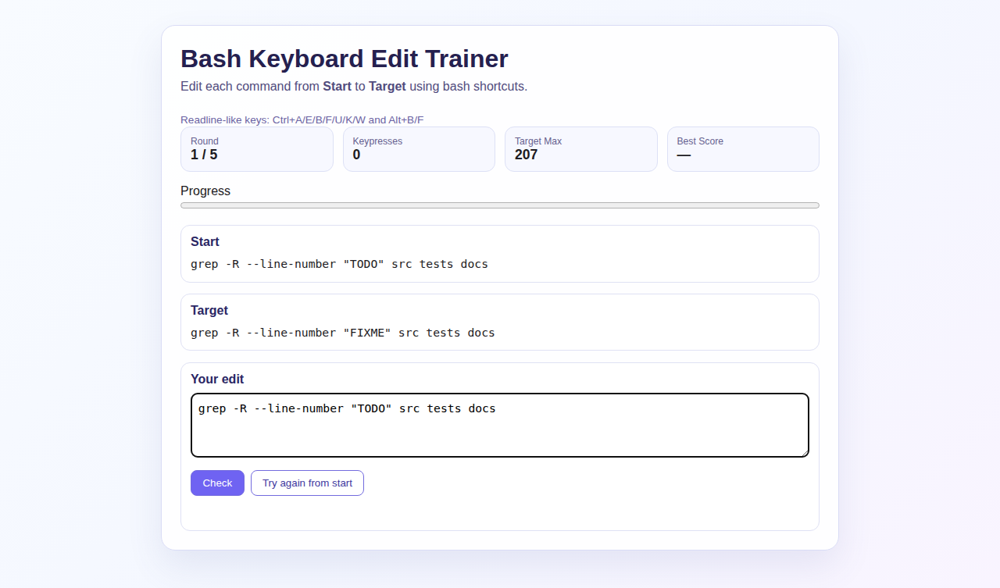

# bash-keyboard-game

A standalone HTML/JavaScript educational game for practicing Bash line-edit keyboard shortcuts.

## Features

- Randomly selected real-world command editing challenges
- Start and target command shown for each round
- Keypress tracking while editing
- Readline-like shortcuts in the editor (Ctrl+A/E/B/F/U/K/W and Alt+B/F)
- Target keypress budget shown per run
- Progress bar across a 5-round session
- Restart button to play again from round 1
- Works as a static site deployable to GitHub Pages

## Development

```bash
npm install
npm run dev
```

## Test

```bash
npm test
```

## Build

```bash
npm run build
```

The build output is generated in `dist/` and committed for standalone static hosting workflows.

## UI Preview


